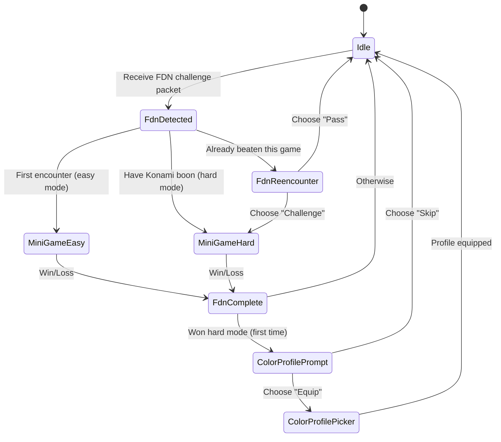

# PDN Game Mechanics

Complete gameplay guide for all minigames in the Portable Data Node FDN system.

## Table of Contents

- [Konami Progression System](#konami-progression-system)
- [Color Profile System](#color-profile-system)
- [FDN Encounter Flow](#fdn-encounter-flow)
- [Minigames](#minigames)
  - [Signal Echo](#signal-echo)
  - [Ghost Runner](#ghost-runner)
  - [Spike Vector](#spike-vector)
  - [Firewall Decrypt](#firewall-decrypt)
  - [Cipher Path](#cipher-path)
  - [Exploit Sequencer](#exploit-sequencer)
  - [Breach Defense](#breach-defense)
- [Difficulty Tuning](#difficulty-tuning)

---

## Konami Progression System

The Konami system is a **meta-game** that tracks player progression across all 7 minigames.

### Konami Buttons

Each minigame unlocks a specific button from the classic Konami controller:

| Button | Index | Minigame | GameType |
|--------|-------|----------|----------|
| **UP** | 0 | Signal Echo | `SIGNAL_ECHO` |
| **DOWN** | 1 | Spike Vector | `SPIKE_VECTOR` |
| **LEFT** | 2 | Firewall Decrypt | `FIREWALL_DECRYPT` |
| **RIGHT** | 3 | Cipher Path | `CIPHER_PATH` |
| **B** | 4 | Exploit Sequencer | `EXPLOIT_SEQUENCER` |
| **A** | 5 | Breach Defense | `BREACH_DEFENSE` |
| **START** | 6 | Ghost Runner | `GHOST_RUNNER` |

### Progression Tracking

Progress is stored as a **7-bit bitmask**:

```
0b0FEDCBA  (bits 0-6, MSB unused)
  │││││││
  ││││││└─ UP (Signal Echo)
  │││││└── DOWN (Spike Vector)
  ││││└─── LEFT (Firewall Decrypt)
  │││└──── RIGHT (Cipher Path)
  ││└───── B (Exploit Sequencer)
  │└────── A (Breach Defense)
  └─────── START (Ghost Runner)
```

**Example:**
- `0x01` (0b0000001) = Only Signal Echo unlocked
- `0x7F` (0b1111111) = All 7 buttons unlocked
- `0x55` (0b1010101) = UP, LEFT, B, START unlocked

### Konami Boon

When all 7 buttons are collected (`progress == 0x7F`), the player earns the **Konami Boon**:
- Auto-set when `player->hasAllKonamiButtons()` returns true
- Grants special reward (implementation TBD)
- Persists across sessions (NVS: `konami_boon`)

### CLI Commands

```bash
# View progress
progress 0

# Set progress directly (for testing)
konami 0 127  # Unlock all buttons (0x7F)
konami 0 1    # Unlock only Signal Echo (0x01)
```

---

## Color Profile System

Players unlock **custom LED color profiles** by beating minigames on **hard mode**.

### Earning Profiles

- Beat any minigame on **EASY** = unlock Konami button
- Beat any minigame on **HARD** = unlock Konami button **+ color profile eligibility**

### Equipped Profile

- **Default:** Hunter/Bounty-specific default colors
- **Game-Specific:** Unlock by beating that game on hard mode
- Only one profile can be equipped at a time
- Profile persists across sessions (NVS: `color_profile`)

### Profile Application

When a color profile is equipped:
- **Idle state LEDs** use the game's color scheme
- **Duel animations** may incorporate profile colors (implementation-dependent)

### CLI Commands

```bash
# View color profiles
colors 0

# Output:
# [*] HUNTER DEFAULT (default)
# [ ] Ghost Runner (equipped)
# [X] Spike Vector (locked - beat hard mode to unlock)
```

---

## FDN Encounter Flow

FDN (Field Data Node) encounters are the mechanism for NPC minigame challenges.

### Encounter Sequence



### FDN Challenge Packet

NPCs broadcast FDN challenges via ESP-NOW:

```cpp
PktType::FDN_CHALLENGE
Payload: {
    gameType: uint8_t,       // 0-6 (GameType enum)
    reward: uint8_t,         // Konami button index
    difficulty: uint8_t,     // 0 = easy, 1 = hard
}
```

### Difficulty Routing

**First Encounter (Easy Mode):**
- Player sees game for first time
- FdnDetected launches easy mode
- Win = unlock Konami button
- Loss = no reward (can retry)

**Konami Boon Unlocked (Hard Mode):**
- Player has collected all 7 buttons
- FdnDetected launches hard mode automatically
- Win = unlock color profile eligibility
- Loss = no reward (can retry)

**Re-encounter:**
- Player has already beaten this game (button unlocked)
- FdnReencounter prompts: "Challenge" (hard mode) or "Pass"
- "Challenge" = recreational mode (no rewards, for fun)
- "Pass" = return to Idle

### Recreational Mode

When replaying already-beaten content:
- `player->setRecreationalMode(true)`
- FdnComplete skips reward logic
- No Konami button unlock (already have it)
- No color profile unlock (only first hard win)

---

## Minigames

All 7 minigames follow a common structure:
1. **Intro** (2s) - Title screen
2. **Show** (1.5s) - Round/wave info
3. **Gameplay** - Player interaction
4. **Evaluate** - Check win/loss
5. **Win/Lose** (3s) - Outcome display

---

## Signal Echo

**Genre:** Memory/Arrow Sequence (Simon Says)
**App ID:** 2 | **GameType:** `SIGNAL_ECHO` | **Konami:** UP (0)

**Updated:** Wave 18 redesign (#246) — visual arrow sequence display with slot-based UI

### Rules

1. **Show phase:** Device displays a sequence of UP/DOWN arrows in slots (one arrow revealed at a time)
2. **Input phase:** Player reproduces the full sequence from memory using buttons
3. Correct sequence = advance to next round
4. Wrong input = instant loss (no mistake tolerance)
5. Win = complete all rounds perfectly

### Controls

- **PRIMARY** = UP signal (▲)
- **SECONDARY** = DOWN signal (▼)

### Difficulty Parameters

| Parameter | Easy | Hard |
|-----------|------|------|
| `sequenceLength` | 7 arrows | 11 arrows |
| `numSequences` (rounds) | 3 | 5 |
| `displaySpeedMs` | 550 | 400 |
| `allowedMistakes` | 0 | 0 |
| `cumulative` | false | false |
| `timeLimitMs` | 0 (none) | 0 (none) |

### Scoring

- +1 point per correct input
- No mistakes allowed — one error ends the game
- Final score = total correct inputs across all rounds

### Win/Loss Display

- **Win:** "ACCESS GRANTED" + rainbow LED sweep
- **Loss:** "SIGNAL LOST" + red fade

### Strategy Tips

- Watch carefully during show phase (arrows reveal sequentially)
- Easy: 7-slot grid with larger arrow glyphs
- Hard: 11-slot grid with compressed arrow glyphs
- No mistake tolerance — perfection required

---

## Ghost Runner

**Genre:** Memory/Maze Navigation
**App ID:** 4 | **GameType:** `GHOST_RUNNER` | **Konami:** START (6)

**Updated:** Wave 18 redesign (#220) — transformed from rhythm game to memory maze

### Rules

1. **Preview Phase:** Maze displayed with walls visible, then solution path traces from start to exit
2. **Navigation Phase:** Maze disappears, player navigates from memory using button inputs
3. Each round generates a new random maze (recursive backtracker algorithm)
4. Player must reach exit without hitting walls (bonks)
5. Win = complete all rounds without exceeding bonk limit

### Controls

- **PRIMARY** = Move forward in current direction
- **SECONDARY** = Rotate 90° clockwise

### Difficulty Parameters

| Parameter | Easy | Hard |
|-----------|------|------|
| `cols` | 5 | 7 |
| `rows` | 3 | 5 |
| `rounds` | 4 | 6 |
| `lives` (bonks allowed) | 3 | 2 |
| `previewMazeMs` | 4000 | 3000 |
| `previewTraceMs` | 4000 | 2500 |
| `bonkFlashMs` | 1000 | 800 |

### Scoring

- +100 points per round completed
- Bonks decrement lives counter
- Bonk penalty flashes maze briefly

### Win/Loss Display

- **Win:** "RUN COMPLETE"
- **Loss:** "GHOST CAUGHT"

### Strategy Tips

- Memorize the solution path during preview
- Easy mode has smaller maze (5×3) with longer preview times
- Hard mode has larger maze (7×5) and shorter preview
- Preview time shrinks each round (0.85× multiplier)

---

## Spike Vector

**Genre:** Reaction/Side-scrolling Gauntlet
**App ID:** 5 | **GameType:** `SPIKE_VECTOR` | **Konami:** DOWN (1)

**Updated:** Wave 18 redesign (#223) — side-scrolling wall formation system with progressive difficulty

### Rules

1. Formation of spike walls scrolls left across screen (side-scrolling)
2. Each wall has a gap in one of 5/7 lanes
3. Player moves cursor UP/DOWN to align with gaps
4. When wall reaches player position = collision check
5. Player at gap = dodge; elsewhere = hit
6. Win = survive all 5 levels; each level increases speed and wall count

### Controls

- **PRIMARY** = Move cursor UP (decrease lane)
- **SECONDARY** = Move cursor DOWN (increase lane)

### Difficulty Parameters

| Parameter | Easy | Hard |
|-----------|------|------|
| `numPositions` (lanes) | 5 | 7 |
| `levels` | 5 | 5 |
| `baseWallCount` | 5 (level 1) | 8 (level 1) |
| `wallCountIncrement` | +1 per level | +1 per level |
| `baseSpeedLevel` | 1 (60ms/px) | 5 (30ms/px) |
| `speedLevelIncrement` | +1 per level | +1 per level |
| `hitsAllowed` | 3 | 1 |

### Scoring

- +100 points per successful dodge
- Hits decrement health counter
- Score accumulates across all levels

### Win/Loss Display

- **Win:** "VECTOR CLEAR"
- **Loss:** "SPIKE IMPACT"

### Strategy Tips

- Each level gets faster and has more walls (progressive difficulty)
- Easy: starts slow (60ms/pixel), 5 lanes, 5-8 walls per level
- Hard: starts fast (30ms/pixel), 7 lanes, 8-12 walls per level
- Gap positioning is randomized per wall (max distance constraint)

---

## Firewall Decrypt

**Genre:** Pattern Recognition/Terminal Breach
**App ID:** 3 | **GameType:** `FIREWALL_DECRYPT` | **Konami:** LEFT (2)

**Updated:** Wave 18 redesign (#256) — expanded candidate list with "needle in haystack" difficulty

### Rules

1. Target MAC address displayed at top
2. Scrollable list of candidates below (includes target + many decoys)
3. Player scrolls with PRIMARY, confirms with SECONDARY
4. Correct match = advance round; wrong = mistake penalty or instant loss
5. Win = identify target in all rounds

### Controls

- **PRIMARY** = Scroll down through candidates
- **SECONDARY** = Confirm selection

### Difficulty Parameters

| Parameter | Easy | Hard |
|-----------|------|------|
| `numCandidates` | 15 | 40 |
| `numRounds` | 3 | 4 |
| `similarity` | 0.5 (confusing) | 0.7 (very similar) |
| `timeLimitMs` | 0 (none) | 12000 (12s, depletes per round) |
| `mistakesAllowed` | 3 | 1 |

### Scoring

- Points based on speed and decoy similarity
- Faster identification = higher score

### Win/Loss Display

- **Win:** "DECRYPTED!"
- **Loss:** "FIREWALL INTACT"

### Strategy Tips

- Compare byte-by-byte (MAC format: `XX:XX:XX:XX`)
- Easy: 15 candidates with 50% similarity, unlimited time
- Hard: 40 candidates (large haystack) with 70% similarity, 12s timer
- Timer depletes each round in hard mode

---

## Cipher Path

**Genre:** Puzzle/Wire Rotation (BioShock-inspired)
**App ID:** 6 | **GameType:** `CIPHER_PATH` | **Konami:** RIGHT (3)

**Updated:** Wave 18 redesign (#242) — wire routing puzzle with real-time electricity flow

### Rules

1. Grid of scrambled wire tiles connects input terminal to output terminal
2. Tiles include: straight wires, elbows, T-junctions, crosses, endpoints
3. **Rotation phase:** Player rotates tiles to reconnect the circuit
4. **Flow phase:** Electricity flows pixel-by-pixel through connected path
5. Flow reaches dead end or wrong rotation = loss
6. Flow successfully reaches output = win

### Controls

- **PRIMARY** = Move cursor to next tile on path
- **SECONDARY** = Rotate current tile 90° clockwise

### Difficulty Parameters

| Parameter | Easy | Hard |
|-----------|------|------|
| `cols` | 5 | 7 |
| `rows` | 4 | 5 |
| `rounds` | 1 | 3 |
| `flowSpeedMs` (ms/pixel) | 200 (~1.8s/tile) | 80 (~0.7s/tile) |
| `flowSpeedDecayMs` | 0 (N/A) | 10 (gets faster each round) |
| `noisePercent` | 30% | 40% |

### Scoring

- Based on completion time and rounds completed
- Penalty for failed attempts

### Win/Loss Display

- **Win:** "PATH DECODED"
- **Loss:** "PATH LOST"

### Strategy Tips

- Trace the path from input to output first
- Easy mode: single 5×4 puzzle, ~20s flow duration
- Hard mode: 3 rounds on 7×5 grid, flow accelerates each round (80→70→60 ms/pixel)
- Noise wires are visual distractors (not part of path)

---

## Exploit Sequencer

**Genre:** QTE (Quick Time Event)
**App ID:** 7 | **GameType:** `EXPLOIT_SEQUENCER` | **Konami:** B (4)

### Rules

1. Symbol scrolls across buffer (position 0 → `scrollLength`)
2. Player presses PRIMARY when symbol reaches marker
3. Hit = within `timingWindow` of marker; miss = outside
4. Multiple exploits per sequence, multiple sequences per game
5. Win = execute all exploits; Loss = fails exceed limit

### Controls

- **PRIMARY** = Attempt exploit

### Difficulty Parameters

| Parameter | Easy | Hard |
|-----------|------|------|
| `scrollSpeedMs` | 40 | 25 |
| `timingWindow` | 15 (wide) | 6 (narrow) |
| `markerPosition` | 50 (center) | 50 (center) |
| `scrollLength` | 100 | 100 |
| `exploitsPerSeq` | 2 | 4 |
| `sequences` | 2 | 4 |
| `failsAllowed` | 3 | 1 |

### Scoring

- +100 points per successful hit
- Fails decrement strike counter

### Win/Loss Display

- **Win:** "EXPLOIT DONE"
- **Loss:** "EXPLOIT FAILED"

### Strategy Tips

- Watch the marker position (center of screen)
- Press when symbol overlaps marker
- Hard mode: faster scroll + narrower window (6 units)

---

## Breach Defense

**Genre:** Reaction/Lane Defense (Pong × Invaders)
**App ID:** 8 | **GameType:** `BREACH_DEFENSE` | **Konami:** A (5)

**Updated:** Wave 18 redesign (#231) — multi-lane threat defense with overlapping attacks

### Rules

1. Threats spawn in random lanes and advance toward defense line
2. Player moves shield UP/DOWN to position in lanes
3. When threat reaches defense line = collision check
4. Shield at threat lane = block; elsewhere = breach
5. **Multiple threats on screen at once** (up to 2-3 simultaneous)
6. Win = block all threats; Loss = breaches exceed limit

### Controls

- **PRIMARY** = Move shield UP (decrease lane)
- **SECONDARY** = Move shield DOWN (increase lane)

### Difficulty Parameters

| Parameter | Easy | Hard |
|-----------|------|------|
| `numLanes` | 3 | 5 |
| `threatSpeedMs` | 40 | 20 |
| `threatDistance` | 100 | 100 |
| `totalThreats` | 6 | 12 |
| `missesAllowed` | 3 | 1 |
| `spawnIntervalMs` | 1500 | 700 |
| `maxOverlap` | 2 | 3 |

### Scoring

- +100 points per successful block
- Breaches decrement health counter

### Win/Loss Display

- **Win:** "BREACH BLOCKED"
- **Loss:** "BREACH OPEN"

### Strategy Tips

- Track multiple threats simultaneously (overlapping attacks)
- Easy: 3 lanes, 2 max on screen, spawns every 1.5s
- Hard: 5 lanes, 3 max on screen, spawns every 0.7s (rapid-fire)
- Threats move independently — prioritize based on proximity

---

## Difficulty Tuning

### Easy vs Hard Mode Comparison

| Aspect | Easy Mode | Hard Mode |
|--------|-----------|-----------|
| **Speed** | Slower (40-50ms) | Faster (20-30ms) |
| **Precision** | Wider windows/zones | Narrower windows/zones |
| **Rounds** | Fewer (2-5) | More (4-8) |
| **Mistakes** | Generous (2-3) | Strict (1-2) |
| **Time Limits** | Often none | Sometimes enforced |
| **Complexity** | Fewer options/lanes | More options/lanes |

### Tuning Principles

1. **Speed:** Hard mode is ~50% faster (lower ms values)
2. **Margin:** Hard mode has ~50% narrower hit windows
3. **Endurance:** Hard mode has ~50-100% more rounds/waves
4. **Forgiveness:** Hard mode allows 1-2 mistakes vs 2-3 in easy

### Balancing Goals

- **Easy:** Accessible to all players, focuses on learning mechanics
- **Hard:** Requires mastery, tests reaction time and precision
- **Progression:** Easy unlocks content, hard unlocks cosmetics

### Attempt Tracking

Per-game per-difficulty attempt counters (persisted to NVS):

```cpp
player->incrementEasyAttempts(GameType::GHOST_RUNNER);
player->incrementHardAttempts(GameType::GHOST_RUNNER);

uint8_t easyAttempts = player->getEasyAttempts(GameType::GHOST_RUNNER);
uint8_t hardAttempts = player->getHardAttempts(GameType::GHOST_RUNNER);
```

**Use Cases:**
- Track player progression
- Adjust difficulty dynamically (future)
- Server analytics

---

## Minigame Selection Guide

| Game | Best For | Skill Focus | Wave 18 Status |
|------|----------|-------------|----------------|
| **Signal Echo** | Memory | Pattern recognition | Redesigned (#246) |
| **Ghost Runner** | Spatial Memory | Maze navigation | Redesigned (#220) |
| **Spike Vector** | Reflexes | Lane dodging | Redesigned (#223) |
| **Firewall Decrypt** | Observation | Detail focus | Redesigned (#256) |
| **Cipher Path** | Puzzle Logic | Wire routing | Redesigned (#242) |
| **Exploit Sequencer** | Timing | QTE precision | Unchanged |
| **Breach Defense** | Multitasking | Lane defense | Redesigned (#231) |

---

## Wave 18/19 Changes Summary

### Wave 18 (Visual Redesigns - PRs #220, #223, #231, #242, #246, #256, #257)

All 7 minigames underwent major visual and mechanical redesigns to improve gameplay variety and accessibility:

**Signal Echo (#246)**
- **Old:** Timing-based rhythm game
- **New:** Arrow sequence memory game (Simon Says)
- **Changes:** Slot-based visual layout, 7-arrow (easy) / 11-arrow (hard) sequences, no mistake tolerance

**Ghost Runner (#220)**
- **Old:** Rhythm/timing ghost-catching game
- **New:** Memory maze navigation
- **Changes:** Procedural maze generation (recursive backtracker), preview-then-navigate gameplay, maze sizes 5×3 (easy) / 7×5 (hard)

**Spike Vector (#223)**
- **Old:** Single-wall dodging
- **New:** Side-scrolling wall gauntlet with progressive difficulty
- **Changes:** 5 levels with increasing speed and wall count, walls scroll from right to left, 5-lane (easy) / 7-lane (hard)

**Cipher Path (#242)**
- **Old:** Linear pathfinding with move budget
- **New:** BioShock-inspired wire rotation puzzle
- **Changes:** Grid-based wire tiles (straight, elbow, T, cross), real-time electricity flow, rotation controls, 5×4 (easy) / 7×5 (hard)

**Firewall Decrypt (#256)**
- **Old:** Small candidate list (5-10 MACs)
- **New:** "Needle in haystack" with large candidate pools
- **Changes:** 15 candidates (easy) / 40 candidates (hard), increased similarity (0.5 / 0.7), depleting timer in hard mode (12s→10s→8s→6s)

**Breach Defense (#231)**
- **Old:** Single threat per wave
- **New:** Pong × Invaders combo defense with overlapping threats
- **Changes:** Multiple threats on screen (2-3 simultaneous), independent threat movement, rapid spawning (1.5s / 0.7s intervals), 3-lane (easy) / 5-lane (hard)

**Exploit Sequencer**
- No redesign in Wave 18 (already QTE-based)

**KonamiMetaGame / The Cipher Wall (#257)**
- Visual redesign for code entry puzzle (not detailed in GAME-MECHANICS.md)

### Wave 19 (Fixes and Infrastructure - PRs #283, #284, #287, #288, #292, #294)

**Bug Fixes:**
- Fixed FdnDetected handshake deadlock (#292)
- Fixed "pure virtual method called" crash (#292)
- Fixed cable disconnect handling

**Testing:**
- Disabled 61 obsolete integration tests pending Wave 18 API updates (#284)
- Multi-player integration test harness (#288)
- E2E demo walkthrough validation (#283)

**Documentation:**
- Updated demo scripts for all 7 redesigns (#287)
- Post-redesign code cleanup (#294)

**Architecture Impact:**
- All minigames have new state machine patterns and config structures
- Old APIs (rhythm game timing, binary cipher paths) completely replaced
- Demo scripts updated to match new gameplay mechanics

---

## Further Reading

- [API.md](API.md) - Player progression API
- [STATE-MACHINES.md](STATE-MACHINES.md) - Minigame state flows
- [ARCHITECTURE.md](ARCHITECTURE.md) - System design
- [HACKATHON-REPORT.md](HACKATHON-REPORT.md) - Development history
- [CLI-PLAYTHROUGH-REPORT.md](CLI-PLAYTHROUGH-REPORT.md) - Testing results and Wave 19 bug fixes

---

*Last Updated: 2026-02-16 (Wave 18/19 redesigns)*
